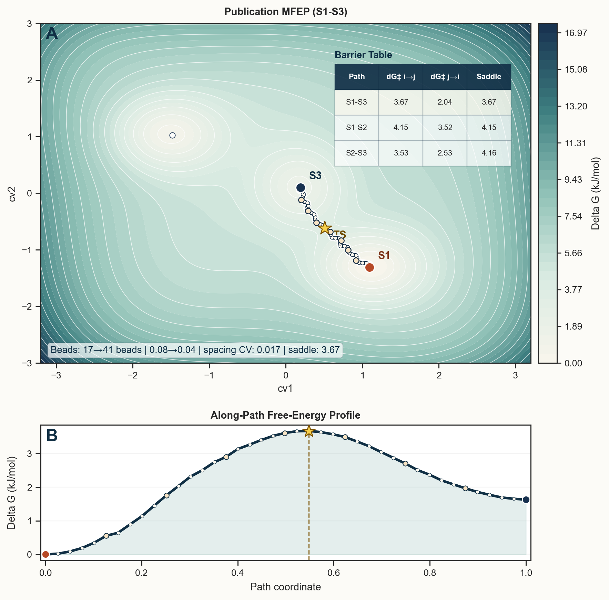
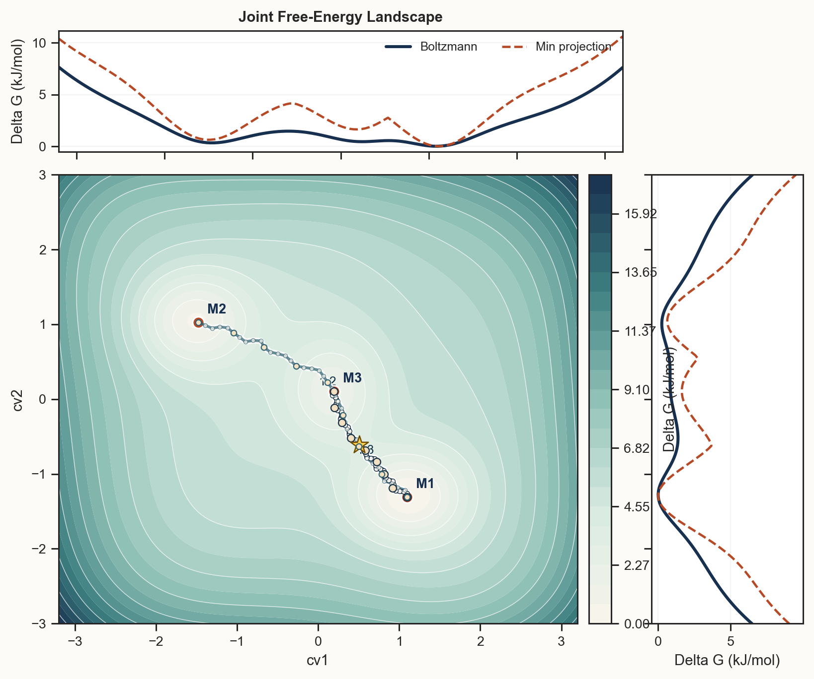
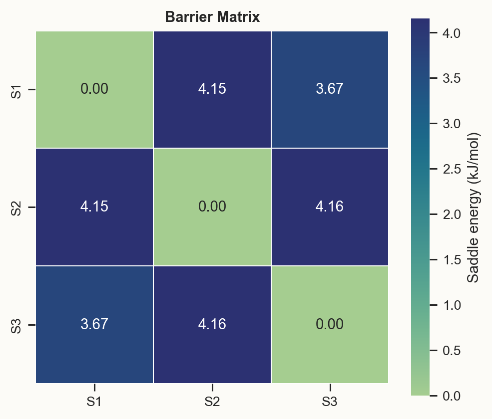

# FES Studio

FES Studio is a post-processing and visualization toolkit for enhanced-sampling free-energy surfaces. It supports direct `fes.dat` analysis, METAD/OPES run-directory import, MFEP optimization, and publication-grade figure export.

## Highlights

- Read `fes.dat`-like whitespace-delimited files with optional `#! FIELDS` headers
- Import FES directly from conventional `METAD` and `OPES` output directories
- 1D analysis: minima, basins, adjacent barriers, probabilities, publication profiles
- 2D analysis: minima, basin decomposition, populations, marginal free energies, barrier matrices
- `NEB`-inspired elastic-string MFEP with two-stage coarse-to-fine optimization
- Manual primary MFEP pair selection, MFEP publication mode, optional barrier-table overlay
- Multiple mainstream color themes for publication figures
- Bilingual UI and report export (`English / 中文`)
- Figures always stay in English for manuscript use
- Export bundle: `PNG / PDF / SVG / HTML / CSV / XLSX / Markdown`
- Cross-platform launch, repair, and CLI wrappers for macOS, Linux, and Windows

## Gallery

### MFEP Publication Figure



### 2D Publication Landscape



### Barrier Heatmap



## Supported Platforms

- macOS
- Ubuntu / Linux
- Windows

Python `3.11+` is required.

## Quick Start

### One-Click Install

If you want the shortest path for end users:

- macOS: `./install_fes_studio.command`
- Linux: `./install_fes_studio.sh`
- Windows: `install_fes_studio.bat`

These installers create `.venv`, upgrade `pip`, and install FES Studio in editable mode.

### Manual Install

1. Clone or download this repository.
2. Create a virtual environment.
3. Install the project in editable mode.
4. Launch the app with the platform-specific starter.

#### macOS

```bash
python3 -m venv .venv
source .venv/bin/activate
python -m pip install --upgrade pip
pip install -e .
./launch_fes_studio.command
```

#### Ubuntu / Linux

```bash
python3 -m venv .venv
source .venv/bin/activate
python -m pip install --upgrade pip
pip install -e .
chmod +x launch_fes_studio.sh run_fes_cli.sh repair_fes_studio_env.sh install_fes_studio.sh
./launch_fes_studio.sh
```

#### Windows

```bat
py -3 -m venv .venv
.venv\Scripts\activate
python -m pip install --upgrade pip
pip install -e .
launch_fes_studio.bat
```

The launcher reuses an already running local instance when possible and tries to open the browser automatically. If browser auto-open does not work on a given machine, open the printed local URL manually.

If the local environment looks broken, run the matching repair wrapper first:

- macOS: `./repair_fes_studio_env.command`
- Linux: `./repair_fes_studio_env.sh`
- Windows: `repair_fes_studio_env.bat`

## CLI

Analyze an existing FES file:

```bash
./run_fes_cli.sh analyze /path/to/fes.dat --output-dir ./exports
```

On Windows:

```bat
run_fes_cli.bat analyze C:\path\to\fes.dat --output-dir .\exports
```

Prepare a FES directly from a run directory:

```bash
./run_fes_cli.sh import-run /path/to/run_dir
```

You can also use the Python entry points directly:

```bash
python -m fes_studio.launcher launch
python -m fes_studio.launcher preflight
python -m fes_studio.launcher repair
python -m fes_studio.cli analyze /path/to/fes.dat
```

## Run-Directory Import

FES Studio supports these workflows:

- `METAD`
- `HILLS -> FES` via built-in `sum_hills`
- `BIAS -> FES`
- `COLVAR` reweighting
- `OPES`
- `STATE -> FES`
- `COLVAR` reweighting
- `KERNELS -> STATE -> FES` when `plumed` is available

The helper-script root for OPES/METAD import is auto-detected from:

- `FES_STUDIO_TOOLS_ROOT`
- `FES_STUDIO_OPES_METAD_ROOT`
- `~/Downloads/others/opes-metad`
- `~/Downloads/opes-metad`
- `<repo>/external/opes-metad`
- `<repo>/opes-metad`

## Examples

Built-in `1D` and `2D` demo datasets are available in the GUI and through:

```bash
python -m fes_studio.cli demo
```

## GitHub and CI

This repository now includes:

- A cross-platform GitHub Actions smoke-test workflow at `.github/workflows/ci.yml`
- One-click installers for macOS, Linux, and Windows
- Cross-platform launch scripts
- Cross-platform repair scripts
- Cross-platform CLI wrappers
- A `.gitignore` suited for local environments and generated analysis bundles

The CI workflow verifies:

- Dependency installation
- Python bytecode compilation
- Runtime preflight imports
- Demo file generation
- 1D analysis export on macOS, Linux, and Windows
- 2D analysis export on Linux

## License

This project is released under the MIT License. See [`LICENSE`](LICENSE).

## Publishing Checklist

If you want to publish the project on GitHub for general users, the next steps are:

1. Initialize a Git repository in this folder and push it to GitHub.
2. Make sure the screenshots in `docs/assets` match the visual style you want to present publicly.
3. Let GitHub Actions run once on your remote repository and confirm the matrix is green.
4. Create a tagged release when you want a stable public snapshot.
